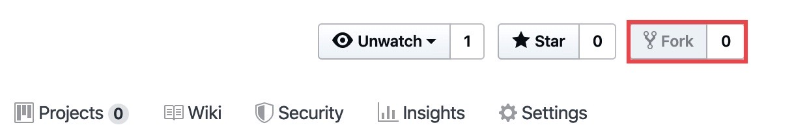

# Souschef

Welcome to Souschef, your kitchen assistant. It will provide recipes and helpful information for over 200 different dishes.
You are free to search recipes various ways, such as by name or by the category of the dish.
Please see below for details on installing and executing this gem on you local machine.

## Installation

Unfortunately, this gem as it stands now cannot be published to rubygems. This is because there is an existing gem
with this name, and I do not want to take the time to configure it to do so.

You may fork and clone the repository where this gem is located by means of either SSH (recommended) or HTTP.

First, fork the repository by clicking the 'fork' button in the top right corner of the screen

To clone using SSH:

    $ git clone git@github.com:your_username_here/souschef.git

To clone using HTTP:

    $ git clone https://github.com/your_username_here/souschef.git

## Development

Run `bin/setup` to install dependencies and required gems. You can also run `bin/console` for an interactive prompt that will allow you to experiment.

Run bin/souschef to execute the application as intended.

## Usage

Follow the prompts in the menu to eventually choose a dish by entering the dish's name.

## Contributing

Bug reports and pull requests are welcome on GitHub at https://github.com/richwblake/souschef.

## License

The gem is available as open source under the terms of the [MIT License](https://opensource.org/licenses/MIT).
